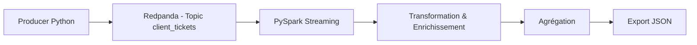

# 🚀 POC – Pipeline temps réel avec Redpanda & PySpark
## 📌 Contexte

Dans le cadre de la modernisation du SI de InduTechData, ce projet consiste à concevoir un **pipeline de données en temps réel** pour traiter des tickets clients issus de flux IoT et applicatifs.

L’objectif est de démontrer la capacité à manipuler des architectures modernes orientées **streaming data**, en s’appuyant sur un écosystème cloud-compatible.

## 🎯 Objectifs
- Simuler la génération de tickets clients en temps réel
- Mettre en place un pipeline de streaming avec Redpanda (Kafka-compatible)
- Traiter et analyser les données avec PySpark
- Produire des indicateurs exploitables automatiquement
- Conteneuriser l’ensemble avec Docker

## 🏗️ Architecture du projet

## ⚙️ Stack technique
- Streaming : Redpanda (alternative performante à Kafka)
- Traitement : PySpark (Structured Streaming)
- Langage : Python
- Conteneurisation : Docker & Docker Compose

## 🔍 Fonctionnalités clés
- Génération de données temps réel (tickets clients simulés)
- Ingestion via un broker Kafka-compatible
- Traitement distribué en streaming
- Enrichissement automatique des données (ex : assignation équipe support)
- Agrégation en continu (ex : nombre de tickets par type)
- Export automatisé des résultats

## 📊 Résultats
- Pipeline temps réel entièrement fonctionnel
- Traitement fiable sans perte de données
- Architecture reproductible et scalable
- Production d’indicateurs exploitables pour le support client

## 💡 Compétences démontrées
- Data Engineering temps réel (streaming)
- Manipulation de systèmes distribués (Kafka / Spark)
- Conception de pipelines ETL
- Conteneurisation et orchestration
- Structuration d’une architecture data moderne

## 🔗 Démonstration

👉 https://www.youtube.com/watch?v=6ZpCe8LNemo

## 📎 Conclusion

Ce projet illustre la mise en place d’un pipeline de données temps réel complet, depuis la génération jusqu’à l’analyse, en utilisant des technologies modernes adaptées aux environnements cloud hybrides.

## 🔗 Lien vers le projet :

https://github.com/ZackKa/Projet_9_data